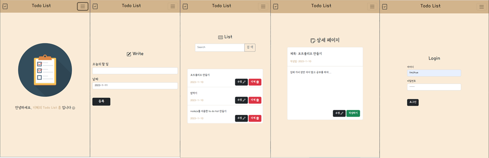

# serverProgram

## :memo: Todo List

> Todo List의 주요 페이지 이미지
 

**NodeJS**를 기반으로 **ejs**문법을 사용하여 만든 **Todo List** 입니다.
사용자가 자주 방문하는 Todo list의 특성을 반영하여, 따뜻한 색상을 사용하여 페이지를 구현하였습니다.

또한, 주요 메뉴들에 한 눈에 들어올 수 있는 명료한 아이콘을 사용하여 가독성을 높였습니다.

---
## :heavy_check_mark: 사용 언어
:small_blue_diamond: **NodeJs**

---

## :heavy_check_mark: DB
:small_blue_diamond: **MongoDB**

비관계형 데이터베이스 관리 시스템인 **MongoDB** 소프트웨어를 사용하여 데이터 베이스를 저장 및 작업하였습니다.

---
## :pushpin: 사용된 기능
:pencil2: **수정**기능
 
:wastebasket: **삭제**기능
 
:mag: **검색**기능
 
:smile: **로그인** 기능
 
:outbox_tray: **데이터 전송** 기능
